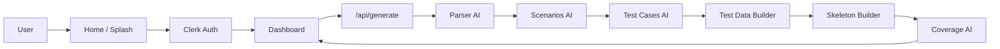

# Architecture

## System overview

## Layers

| Layer | Technology | Responsibility |
|-------|------------|----------------|
| UI | React 19 + Next.js 16 | Splash, auth, dashboard tabs, exports |
| Auth | Clerk | Sign-in/up, session, middleware |
| API | Route Handler + SSE | Orchestrate pipeline, stream progress |
| AI | Groq SDK | Stages 1–3 and 6 (JSON) |
| Local builders | TypeScript | Stages 4–5 (deterministic) |

## Dashboard tabs

Test Cases (default), Scenarios, Test Data, Automation Code, Coverage Report, Traceability — all fed from one `generate` response stored in client state.

## Onboarding (Alex)

- Components: `OnboardingGuide`, `GuideEngineer`, `GuideSpeechBubble`
- State: `localStorage` key `constructqa-onboarding-v1` via `lib/onboarding.ts`
- Scenes: `home`, `sign-in`, `sign-up`, `dashboard`

## Deployment

- **Vercel** with env vars from `.env.example`
- `vercel.json`: extended timeout for `/api/generate`

## Security

- `middleware.ts` protects `/dashboard` and API
- `GROQ_API_KEY` and `CLERK_SECRET_KEY` server-only
- No requirement text persisted server-side (session-only UX)
